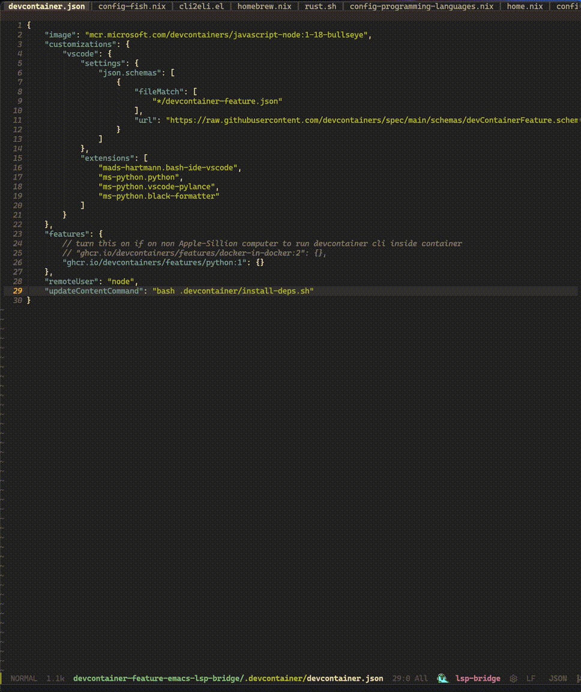
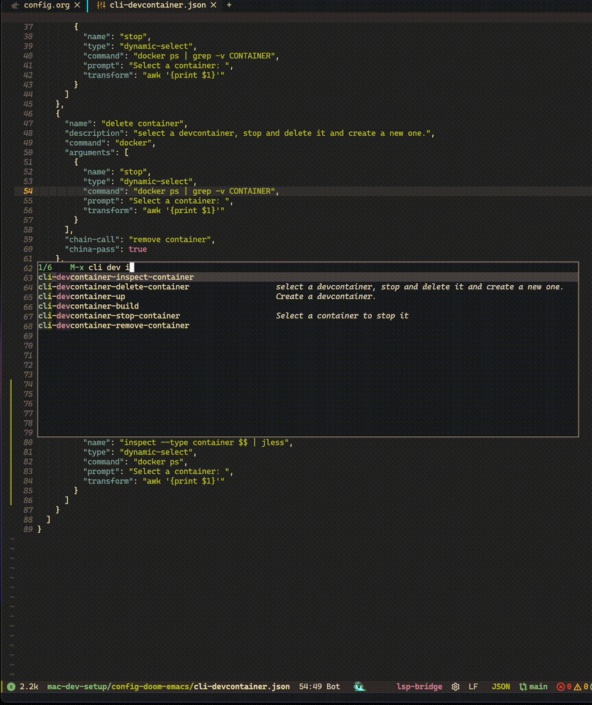
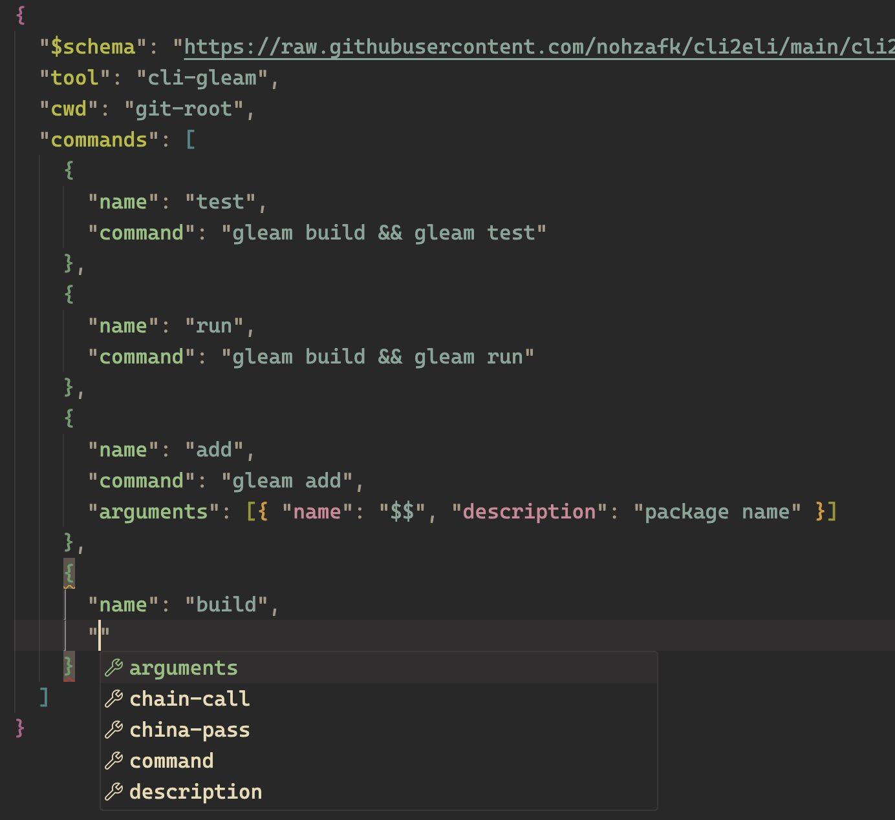

# Command Line Interface to Emacs Launch Interface (CLI2ELI)

## Overview
Wrap any command-line tool to Emacs commands easily.




CLI2ELI is an Emacs package that generates interactive Emacs functions from command-line tool specifications. It allows seamless integration and execution of external CLI tools within Emacs, enhancing developer workflow and productivity.

## Showcase

Inspect a container using jless



## Features
- Dynamic generation of Emacs **interactive functions** from JSON specifications
- Utilization of Emacs' **completion system** for argument input and selection
- Support for various argument types: free text, choices, directory paths, and dynamic selections
- Command chaining for complex operations
- Context-aware command execution (e.g., from git root)
- Support running commands locally even when editing remote file in a **container**

## Installation

### manually
To install CLI2ELI:
1. Clone this repository to your local machine.
2. Add the following lines to your Emacs configuration file:
```lisp
(add-to-list 'load-path "/path/to/CLI2ELI")
(require 'cli2eli)
```

### doom emacs
`packages.el`
```lisp
(package! cli2eli
  :recipe (:host github :repo "nohzafk/cli2eli" :branch "main"))
```

`config.el`

```lisp
(use-package! cli2eli
  :load-path "~/path/to/local/cli2eli"
  (cli2eli-load-tool "~/path/to/config.json"))
```

## Usage

Use `M-x cli2eli-load-tool` to select a JSON file to load the configuration. Alternatively, add it to your init file:

```lisp
(cli2eli-load-tool "~/path/to/config-1.json")
(cli2eli-load-tool "~/path/to/config-2.json")
```

After generating the interactive functions, you can directly invoke the commands associated with your external CLI tools in Emacs. Each command will have a unique prefix, as specified in your JSON configuration, ensuring easy access and organization.

### EAT

[eat](https://codeberg.org/akib/emacs-eat) will be used if it is installed, otherwise fallback to built-in `term`, for displaying the command output buffer and start process asynchronously, becasuse it is blazingly fast.


## Motivation
During software development, especially in containerized environments, developers often find themselves repeatedly executing similar command sequences. For instance:

```bash
docker ps | grep <id>
docker stop <container>
docker rm <container>
devcontainer up
devcontainer build
```

Manually typing these commands in a terminal is time-consuming and error-prone, I'm just tired with repeatly typing those commands. CLI2ELI addresses this by:

1. Allowing these commands to be executed directly from within Emacs
2. Providing an interactive interface for selecting containers or other dynamic values
3. Enabling command chaining for complex operations (e.g., stop and remove a container in one step)

For example, with CLI2ELI, a developer could use write a chain command and use `M-x devcontainer-delete-container` to interactively select and remove a Docker container, all without leaving Emacs or manually constructing the command string.

While not intended to replace the terminal entirely, CLI2ELI significantly streamlines common development tasks by integrating them directly into the Emacs environment, reducing context switching and improving workflow efficiency.

## Configuration Options

### 0. JSON Schema

Use json-schema to help to write configuration JSON, add a "$schema" field to the json file.

```json
"$schema": "https://raw.githubusercontent.com/nohzafk/cli2eli/main/cli2eli-schema.json",
```

i.e. using VSCode



### 1. Simple wrapper
```json
{
  "tool": "devcontainer",
  "cwd": "git-root",
  "commands": [
    {
      "name": "up",
      "description": "Create a dev container.",
      "command": "devcontainer up",
      "arguments": [
        {
          "name": "--workspace-folder"
        }
      ]
    }
  ]
}
```
This configuration creates a simple wrapper for the `devcontainer up` command. The `cwd` set to "git-root" means the command will be executed from the root of the git repository. All arguments are required in this case.

user will be prompt to input a value for `--workspace-folder`

the default behavior is to append a space between argument and argument value

`devcontaienr up --workspace-folder <input-value>`

#### Specify shell

Specify which shell to be used to execute the command, if "shell" field is omitted, default value is `/bin/bash`.

```json
{
"tool": "mytool",
"shell": "/bin/zsh",
"commands": [
  // ... command definitions ...
 ]
}
```

####  Replace variable instead of appending with space

```json
{
  "tool": "configtool",
  "commands": [
    {
      "name": "set",
      "command": "configtool set",
      "arguments": [
        {
          "name": "user=$$",
          "description": "Set the username"
        }
      ]
    }
  ]
}
```
In this example, the `$$` in the argument name will be replaced by the user's input.

This configuration will prompt the user to input the value and the whole argument is combined without a space.

This configuration would allow commands like:
- `configtool set user=john`

The `$$` will be replaced with the user's input, maintaining the required "option=value" format.

### 2. Extra arguments
```json
{
  "tool": "docker",
  "commands": [
    {
      "name": "run",
      "command": "docker run",
      "arguments": [
        {
          "name": "-it --name",
          "description": "Container name"
        }
      ],
      "extra_arguments": true
    }
  ]
}
```
The `extra_arguments` field allows users to input additional arguments when calling the command.

### 3. Multiple arguments
```json
{
  "tool": "git",
  "commands": [
    {
      "name": "commit",
      "command": "git commit",
      "arguments": [
        {
          "name": "-m",
          "description": "Commit message"
        },
        {
          "name": "--author",
          "description": "Author of the commit"
        }
      ]
    }
  ]
}

```
User will be prompted to input value for each argument.

### 4. Choices
```json
{
  "tool": "npm",
  "commands": [
    {
      "name": "run",
      "command": "npm run",
      "arguments": [
        {
          "name": "",
          "choices": ["build", "test", "start", "lint"]
        }
      ]
    }
  ]
}
```
The `choices` field provides a predefined list of options for the user to choose from.

### 5. Directory type
```json
{
  "tool": "project",
  "commands": [
    {
      "name": "init",
      "command": "project-init",
      "arguments": [
        {
          "name": "--path",
          "type": "directory",
          "description": "Select project directory"
        }
      ]
    }
  ]
}
```
The `"type": "directory"` specification in the argument prompts the user to select a directory using Emacs' built-in directory selection interface. This is useful for commands that require a directory path as an argument. In this case, the user will be prompted to choose a directory, and the selected path will be passed to the `project-init` command with the `--path` argument.

These additional examples showcase more advanced features of CLI2ELI, allowing for greater flexibility in command construction and argument input.

### 6. Dynamic select
```json
{
  "tool": "docker",
  "commands": [
    {
      "name": "stop",
      "command": "docker stop",
      "arguments": [
        {
          "name": "",
          "type": "dynamic-select",
          "command": "docker ps --format '{{.ID}} {{.Names}}'",
          "prompt": "Select a container to stop: ",
          "transform": "awk '{print $1}'"
        }
      ]
    }
  ]
}
```
The `dynamic-select` type allows for dynamic generation of choices.
The `command` field specifies how to generate the list, `prompt` is the message shown to the user, and `transform` can modify the selected value.

This is equal to
```bash
docker ps --format '{{.ID}} {{.Names}}' | grep <something> | awk '{print $1}'
```

### 7. Chain call
```json
{
  "tool": "docker",
  "commands": [
    {
      "name": "delete container",
      "command": "docker stop",
      "arguments": [
        {
          "name": "",
          "type": "dynamic-select",
          "command": "docker ps --format '{{.Names}}'",
          "prompt": "Select a container: "
        }
      ],
      "chain-call": "remove container",
      "chain-pass": true
    },
    {
      "name": "remove container",
      "command": "docker rm",
      "arguments": [
        {
          "name": "",
          "type": "dynamic-select",
          "command": "docker ps -a --format '{{.Names}}'",
          "prompt": "Select a container to remove: "
        }
      ]
    }
  ]
}
```
The `chain-call` and `chain-pass` fields allow for sequential execution of commands. In this example, after stopping a container, it will automatically prompt to remove it. This chaining can be cancelled at any point using `Ctrl-g`, providing flexibility in the workflow.

In this example, when `chain-pass` is set to `true`, the result of the `delete container` command is passed to the `remove container` command for selection. This is instead of using the command defined in the `remove container` argument. As a result, after the container is stopped, running `docker ps` again won't display the container.

If you don't need to pass on the value, set `chain-pass` to `false` or leave this field unset.


## Configuration Examples

### wrap a simple tool
```json
{
  "$schema": "https://raw.githubusercontent.com/nohzafk/cli2eli/main/cli2eli-schema.json",
  "tool": "cli-gleam",
  "cwd": "git-root",
  "commands": [
    {
      "name": "test",
      "command": "gleam build && gleam test"
    },
    {
      "name": "add",
      "command": "gleam add",
      "arguments": [{ "name": "$$", "description": "package name" }]
    }
  ]
}
```

This will generate two Emacs commands:
- `cli-gleam-test`, this is equivalent to execute `gleam build && gleam test`
- `cli-gleam-add`, when executed you will be asked to input the package name in the **minibuffer**, this is equivalent to execute `gleam add <package name>`.

### inspect a container using jless
```json
{
  "$schema": "https://raw.githubusercontent.com/nohzafk/cli2eli/main/cli2eli-schema.json",
  "tool": "cli-devcontainer",
  "cwd": "git-root",
  "commands": [
    {
      "name": "inspect container",
      "command": "docker",
      "arguments": [
        {
          "name": "inspect --type container $$ | jless",
          "type": "dynamic-select",
          "command": "docker ps",
          "prompt": "Select a container: ",
          "transform": "awk '{print $1}'"
        }
      ]
    }
  ]
}
```

### wrap devcontainer
```json
{
  "$schema": "https://raw.githubusercontent.com/nohzafk/cli2eli/main/cli2eli-schema.json",
  "tool": "cli-devcontainer",
  "cwd": "git-root",
  "commands": [
    {
      "name": "build",
      "command": "devcontainer build",
      "arguments": [
        {
          "name": "--workspace-folder",
          "choices": ["."]
        },
        {
          "name": "--no-cache=$$",
          "description": "Builds the image with `--no-cache`.",
          "choices": [false, true]
        }
      ]
    },
    {
      "name": "delete container",
      "description": "select a devcontainer, stop and delete it and create a new one.",
      "command": "docker",
      "arguments": [
        {
          "name": "stop",
          "type": "dynamic-select",
          "command": "docker ps | grep -v CONTAINER",
          "prompt": "Select a container: ",
          "transform": "awk '{print $1}'"
        }
      ],
      "chain-call": "remove container",
      "china-pass": true
    },
    {
      "name": "remove container",
      "command": "docker",
      "arguments": [
        {
          "name": "rm",
          "type": "dynamic-select",
          "command": "docker ps",
          "prompt": "Select a container: ",
          "transform": "awk '{print $1}'"
        }
      ]
    }
  ]
}
```

- execute `cli-devcontailer-build`, you will be asked to choice value for option `--workspace-folder` and option `--no-cache`
- execute `cli-devcontainer-delete-container`, you will be asked to select a container from the return result of `docker ps | -v CONTAINER`, the selected line will be passed to `awk '{print $1}'` and then execute `docker stop <value>`, after the execution, another interactive function `cli-devcontainer-remove-container` will be invoked to delete the container.

## License
CLI2ELI is released under the [MIT License](LICENSE.md). Feel free to use, modify, and distribute it as per the license terms.
