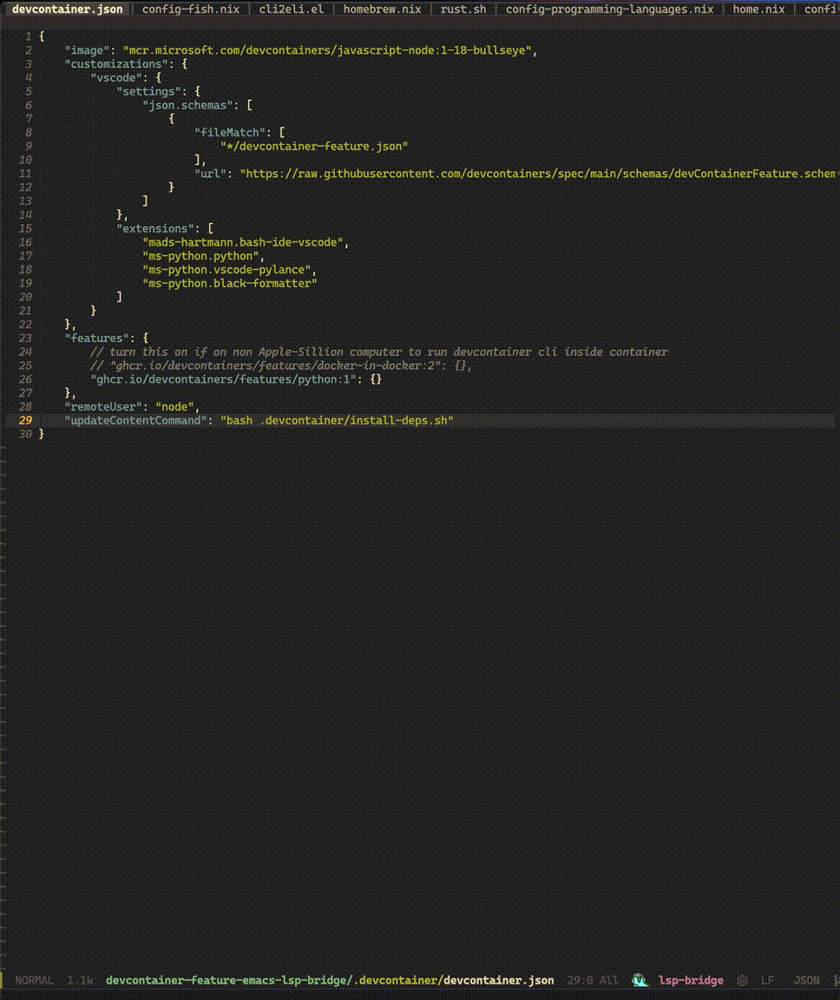
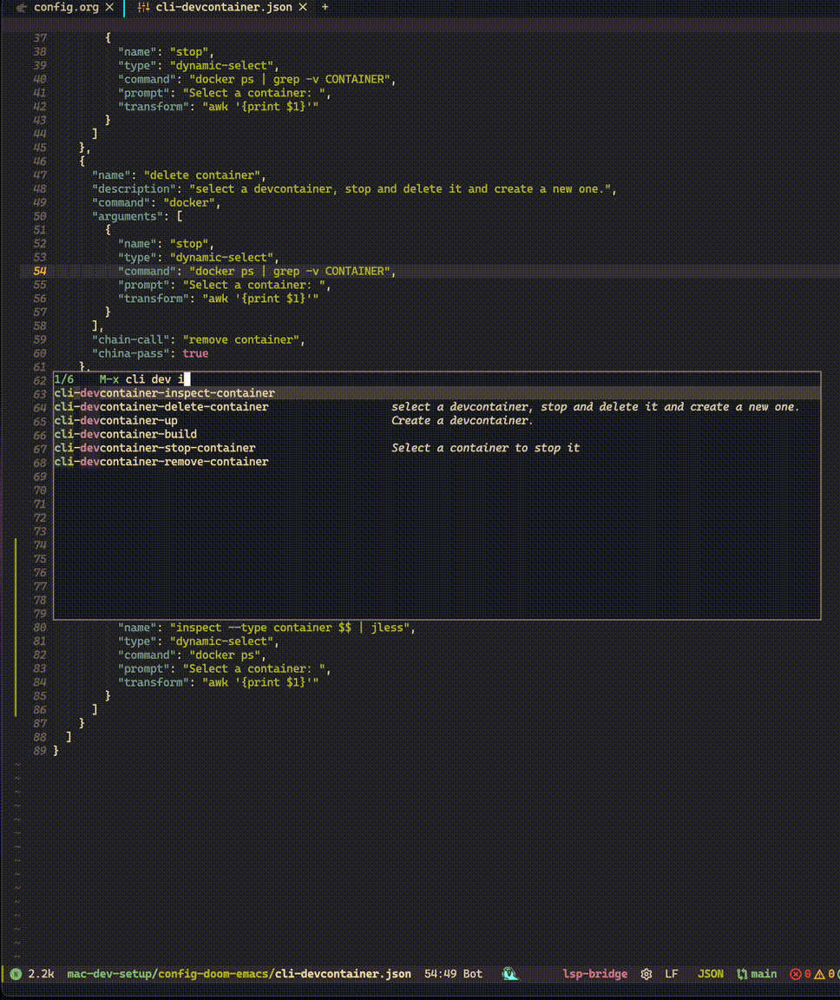

# Command Line Interface to Emacs Launch Interface (CLI2ELI)

## Overview
Wrap any command-line tool to Emacs commands easily.




CLI2ELI generates interactive Emacs functions from JSON configuration files describing CLI tools. Write a simple JSON config, get Emacs commands with completion, dynamic selection, and terminal integration.

## Philosophy

Emacs should easily integrate external command-line tools.

> The core idea of Emacs is to have an expressive digital material and an open-ended, user-extensible set of commands that manipulate that material and can be quickly invoked.
> Obviously, this model can be fruitfully applied to any digital material, not just plain text. [- X](https://x.com/msimoni/status/1727669091870101549?s=46)

## Showcase
### Works with justfile

If you already have a [justfile](https://github.com/casey/just), simply wrap it with following config, now you can select a `just` command to run in Emacs.

```json
{
  "tool": "cli-just",
  "cwd": "git-root",
  "commands": [
    {
      "name": "just",
      "command": "just ${recipe}",
      "inputs": {
        "recipe": {
          "type": "shell",
          "command": "just -l | grep -v Available | sed 's/#.*$//g'",
          "prompt": "Recipe"
        }
      }
    }
  ]
}
```

### Works with docker compose

Select a service and input a command to be executed inside the running container.

```json
{
  "tool": "cli-docker-compose",
  "cwd": "git-root",
  "commands": [
    {
      "name": "execute",
      "command": "docker compose exec ${service} ${program}",
      "inputs": {
        "service": {
          "type": "shell",
          "command": "docker compose config --services",
          "prompt": "Service"
        },
        "program": { "prompt": "Program" }
      }
    }
  ]
}
```

### Inspect a container using jless



## Features
- Dynamic generation of Emacs **interactive functions** from JSON specifications
- **Command templates** with `${var}` placeholders for readable configs
- **Built-in variables** (`${file}`, `${file-relative}`, `${dir}`) for current context
- **Completion system** integration for argument input and selection
- **Dynamic selection** from shell command output
- **Stdin support**: Pipe buffer/region content to commands
- **Output modes**: terminal, buffer display, or in-place text replacement
- Context-aware command execution (e.g., from git root)
- Support for running commands locally even when editing a file in a **container**

## Installation

### manually
1. Clone this repository to your local machine.
2. Add the following lines to your Emacs configuration file:
```lisp
(add-to-list 'load-path "/path/to/CLI2ELI")
(require 'cli2eli)
```

### doom emacs
`packages.el`
```lisp
(package! cli2eli
  :recipe (:host github :repo "nohzafk/cli2eli" :branch "main"))
```

`config.el`

```lisp
(use-package! cli2eli
  :load-path "~/path/to/local/cli2eli"
  (cli2eli-load-tool "~/path/to/config.json"))
```

## Usage

Use `M-x cli2eli-load-tool` to select a JSON file to load the configuration. Alternatively, add it to your init file:

```lisp
(cli2eli-load-tool "~/path/to/config-1.json")
(cli2eli-load-tool "~/path/to/config-2.json")
```

After loading, generated interactive functions are available via `M-x`. Each function is named `<tool>-<command>` (e.g., `cli-quickrun-just`).

## Configuration

### JSON Schema

Use json-schema for editor autocompletion when writing configs:

```json
"$schema": "https://raw.githubusercontent.com/nohzafk/cli2eli/main/cli2eli-schema.json",
```

### Command Templates

Commands use `${var}` placeholders that are resolved from built-in variables or declared inputs:

```json
{
  "tool": "cli-gleam",
  "cwd": "git-root",
  "commands": [
    {
      "name": "test",
      "command": "gleam build && gleam test"
    },
    {
      "name": "add",
      "command": "gleam add ${package}",
      "inputs": {
        "package": { "prompt": "Package name" }
      }
    }
  ]
}
```

This generates:
- `cli-gleam-test` - runs `gleam build && gleam test`
- `cli-gleam-add` - prompts for package name, runs `gleam add <name>`

### Built-in Variables

These are always available in command templates without declaring inputs:

| Variable | Value |
|----------|-------|
| `${file}` | Current buffer's absolute file path |
| `${file-relative}` | File path relative to working directory |
| `${dir}` | Current buffer's directory |

```json
{
  "name": "glow",
  "command": "glow -s dark -t ${file}"
}
```

If you declare a built-in name in `inputs`, your declaration overrides the default (e.g., to prompt for a file path instead of using the current buffer).

### Input Types

Inputs are declared in the `inputs` object. Each key matches a `${var}` in the command template.

#### prompt (default)

Free text input:

```json
"inputs": {
  "message": { "prompt": "Commit message" }
}
```

Undeclared template variables default to prompt inputs with the variable name as the prompt.

#### choice

Pick from a static list:

```json
"inputs": {
  "env": { "choices": ["dev", "staging", "prod"], "prompt": "Environment" }
}
```

#### shell

Pick from shell command output (dynamic selection):

```json
"inputs": {
  "container": {
    "type": "shell",
    "command": "docker ps --format '{{.ID}} {{.Names}}' | awk '{print $1}'",
    "prompt": "Container"
  }
}
```

The command's stdout lines become completion candidates. Include any filtering/transformation in the shell pipeline itself.

#### directory

Emacs directory picker:

```json
"inputs": {
  "path": { "type": "directory", "prompt": "Project directory" }
}
```

#### Optional inputs

Inputs with `"optional": true` are removed from the command when left empty:

```json
{
  "command": "just ${recipe} ${extra}",
  "inputs": {
    "recipe": { "type": "shell", "command": "just -l", "prompt": "Recipe" },
    "extra": { "prompt": "Extra arguments", "optional": true }
  }
}
```

### Stdin - pipe buffer/region content

The `stdin` property pipes buffer or region content to a command:

```json
{
  "name": "format SQL",
  "command": "sqlfmt -",
  "stdin": "region",
  "output": "replace"
}
```

`stdin` accepts:
- `"region"` - selected text, or entire buffer if no selection
- `"buffer"` - always entire buffer content

### Output Modes

The `output` property controls where command output goes:

| Mode | Behavior |
|------|----------|
| `terminal` | Run in eat/term terminal (default for non-stdin commands) |
| `buffer` | Display in read-only output buffer (default for stdin commands) |
| `replace` | Replace the stdin source text in-place |

`replace` is the key mode for text transforms - select text, run command, text is replaced:

```json
{
  "tool": "cli-transform",
  "commands": [
    {
      "name": "format JSON",
      "command": "jq '.'",
      "stdin": "region",
      "output": "replace"
    },
    {
      "name": "Python dict to JSON",
      "command": "python3 -c \"import sys, json, ast; print(json.dumps(ast.literal_eval(sys.stdin.read()), indent=2))\"",
      "stdin": "region",
      "output": "replace"
    }
  ]
}
```

### Working Directory

Set `cwd` at the tool level:

| Value | Behavior |
|-------|----------|
| (omitted) | Current buffer's directory |
| `"default"` | Current buffer's directory |
| `"git-root"` | Git repository root |
| `/explicit/path` | Literal path |

### Specify Shell

```json
{
  "tool": "mytool",
  "shell": "/bin/zsh",
  "commands": [...]
}
```

Default is `/bin/bash`.

## Display Configuration

By default, cli2eli displays the output buffer at the bottom. Customize with:

``` lisp
(setq cli2eli-output-buffer-display-option #'display-buffer-other-frame)
```

### Terminal Backend

CLI2ELI supports terminal backends for command output. By default, it auto-detects in priority order: **eat > term**.

```elisp
;; Auto-detect (default): eat > term
(setq cli2eli-terminal-backend 'auto)

;; Force a specific backend
(setq cli2eli-terminal-backend 'eat)    ; Use eat (recommended)
(setq cli2eli-terminal-backend 'term)   ; Use built-in term
```

- [eat](https://codeberg.org/akib/emacs-eat) - Recommended, pure Emacs Lisp with good performance
- term - Built-in fallback, always available

### TUI Application Support

CLI2ELI fully supports TUI applications like `glow`, `lazygit`, `htop`, etc. When using the `eat` backend:

**Eat Input Modes**

By default, CLI2ELI uses `semi-char` mode:
- Terminal gets most keys (vim navigation, arrow keys, etc.)
- `C-x`, `C-c`, and `M-x` are reserved for Emacs

```elisp
(setq cli2eli-default-eat-mode 'semi-char) ; default
(setq cli2eli-default-eat-mode 'char)      ; all keys to terminal
(setq cli2eli-default-eat-mode 'emacs)     ; standard Emacs editing
(setq cli2eli-default-eat-mode 'line)      ; line-based input
```

**Automatic Window Resize**

TUI applications automatically resize when the Emacs window configuration changes.

## Examples

### Docker container inspection with jless

```json
{
  "tool": "cli-docker",
  "cwd": "git-root",
  "commands": [
    {
      "name": "inspect container",
      "command": "docker inspect --type container ${container} | jless",
      "inputs": {
        "container": {
          "type": "shell",
          "command": "docker ps --format '{{.ID}} {{.Names}}' | awk '{print $1}'",
          "prompt": "Container"
        }
      }
    }
  ]
}
```

### Devcontainer build with options

```json
{
  "tool": "cli-devcontainer",
  "cwd": "git-root",
  "commands": [
    {
      "name": "build",
      "command": "devcontainer build --workspace-folder ${folder} --no-cache=${no_cache}",
      "inputs": {
        "folder": { "choices": ["."], "prompt": "Workspace folder" },
        "no_cache": { "choices": [false, true], "prompt": "No cache" }
      }
    }
  ]
}
```

### Run pytest on current file

```json
{
  "tool": "cli-quickrun",
  "cwd": "git-root",
  "commands": [
    {
      "name": "pytest",
      "command": "pytest -s ${file-relative}"
    }
  ]
}
```

## Motivation
During software development, especially in containerized environments, developers often find themselves repeatedly executing similar command sequences. CLI2ELI addresses this by:

1. Allowing commands to be executed directly from within Emacs
2. Providing an interactive interface for selecting containers or other dynamic values
3. Enabling text transformation workflows with in-place replacement

While not intended to replace the terminal entirely, CLI2ELI streamlines common development tasks by integrating them into the Emacs environment.

## License
CLI2ELI is released under the [MIT License](LICENSE.md). Feel free to use, modify, and distribute it as per the license terms.
